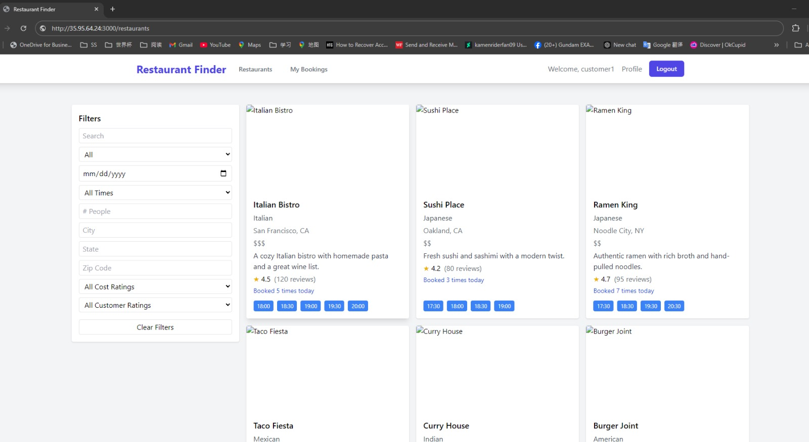

Team Name: Alpha

Team Members: 
Ryan Zhang, Tingfei Gu, Sheetal Yadav, Kawaljeet Kaur

Responsibilities per member:

Ryan Zhang (LaiSensei)
Backend:
All development for the restaurants and users Django apps (models, migrations, views, serializers, filters, tests)
Admin/manager endpoints and dashboards
Backend deployment settings and AWS deployment for these apps

Tingfei Gu (SoulMind01)
Backend:
All development for the bookings and reviews Django apps (models, migrations, views, serializers, filters, tests)
Customer endpoints, analytics, and database migration/backup
Backend deployment and AWS deployment for these apps

Sheetal Yadav (SheetalYadav01)
Frontend:
All React frontend development (app setup, routing, all pages, UI components, Redux, dashboards)
Frontend authentication, booking, review, and dashboard UIs
Frontend testing, build, and deployment

Kawaljeet Kaur:
Documentation and Sprint Reviews

## Product Backlog
[product backlog](./Product%20Backlog.pdf)

## Project Journal
[project journal](./Project%20Journal.pdf)

## Sprint Backlog
[sprint backlog](./Sprint%20Backlog%20-%20Sheet1.pdf)

## Feature set
Browse Restaurant Page and Search Filter

Restaurant Details Page with Reviews and Google Map

Book Table Page with SMS and Email Nofication Function

My Booking page with cancel function

Manager dashboard page with add and edit restaurant

Admin Dashboard

Admin Approval Page

Admin Remove Page

## Diagrams
Class Diagram

Use Case Diagram

Deployment Diagram

Activity Diagram

Project Journal Link:
https://drive.google.com/drive/folders/1u7f4pGdXYHN1gdKzptPo1bPYElRvz5KZ?usp=sharing
